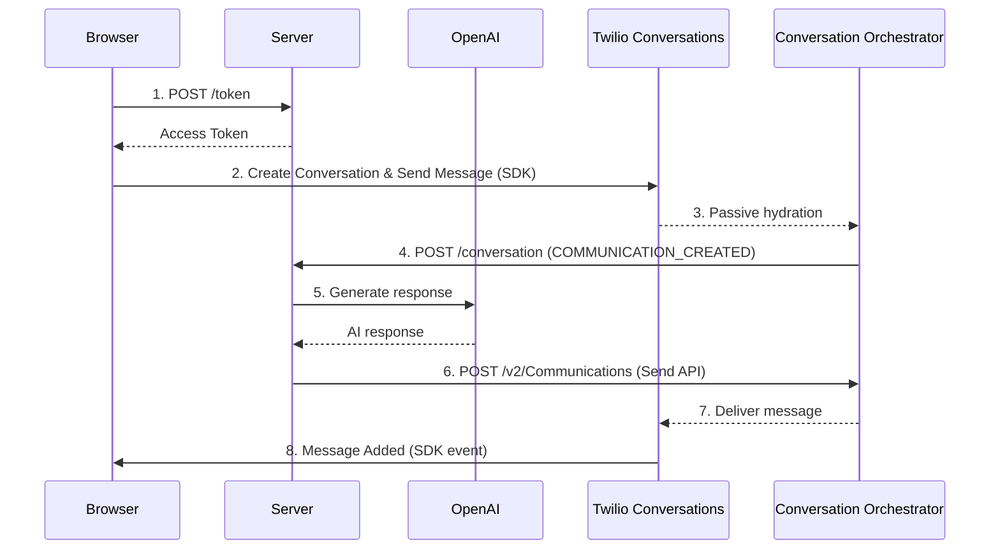

# TAC Chat Example

Example demonstrating ChatChannel integration with Twilio Agent Connect. Uses the Twilio Conversations JS SDK for web chat conversations.

## Setup

1. From the repository root, install and build the SDK:
   ```bash
   npm install
   npm run build
   ```

2. Configure environment variables. From the `getting_started/examples/` directory, copy and fill in the template:
   ```bash
   cp .env.example .env
   # Edit .env with your credentials
   ```

   Required credentials:
   - Standard TAC credentials (Account SID, Auth Token, API credentials, Conversation Orchestrator configuration ID: `TWILIO_CONVERSATION_CONFIGURATION_ID`)
   - `TWILIO_CONVERSATION_SERVICE_SID` - Conversations v1 Service SID (starts with IS, **not** the Conversation Orchestrator configuration ID)
   - `OPENAI_API_KEY` - OpenAI API key

3. Install the example's dependencies:
   ```bash
   cd getting_started/examples/chat
   npm install
   ```

4. Start the server:
   ```bash
   npm start
   ```

5. Open http://localhost:8000 in your browser

## How it Works

1. **Frontend**: Browser-based chat with Twilio Conversations SDK
   - Select from predefined email identities (e.g., `test1@example.com`) for identity resolution
   - Fetches access token from `/token` endpoint
   - Creates conversation lazily on first message
   - Sends messages via Conversations SDK
   - Displays AI responses in real-time

2. **Backend**: Standalone Fastify server with TAC + ChatChannel + OpenAI
   - `POST /token` — generates Conversations SDK access token
   - `POST /conversation` — Conversation Orchestrator webhook endpoint
   - Routes webhook events to ChatChannel
   - Calls OpenAI gpt-4o-mini for responses
   - Sends responses via Conversation Orchestrator Send API

## Architecture



## Testing

1. Start the server and open http://localhost:8000
2. Type a message (conversation is created automatically)
3. AI responds via OpenAI
4. Check server logs to see:
   - Token generation
   - Webhook routing to ChatChannel
   - Send API calls with `channel='CHAT'`

## Notes

- Conversations are created client-side by the Conversations SDK
- The backend receives webhook events from Conversation Orchestrator
- Messages from the AI agent (`ai-agent`) are filtered out to prevent echo
