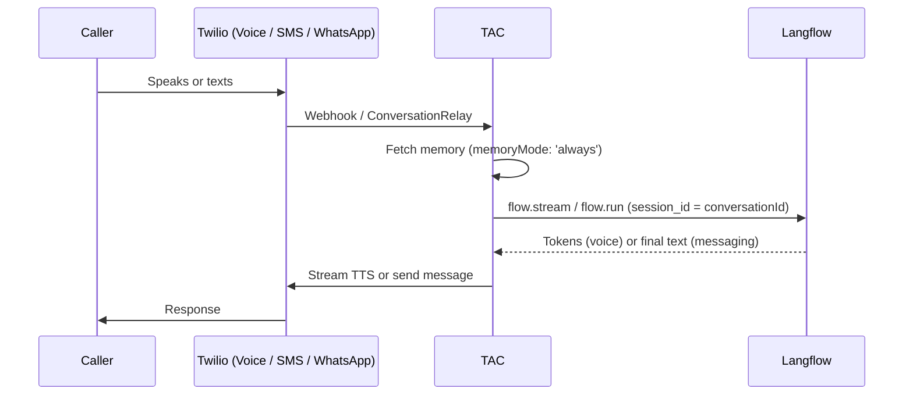

# TAC Langflow Example

Use a [Langflow](https://www.langflow.org/) flow as the agent "brain" while Twilio Agent Connect owns everything around it: the **Voice, SMS, and WhatsApp** channels, memory injection, token-by-token voice streaming via ConversationRelay, and conversation continuity.

The flow owns the system prompt, tools, and any knowledge/RAG — you build it visually in Langflow. TAC handles the telephony and messaging. This example is intentionally minimal: ~80 lines in [`src/index.ts`](src/index.ts).

## How it works

- **Voice** streams the flow's tokens straight to ConversationRelay (`flow.stream(...)` → `voiceChannel.sendStreamingResponse(...)`) for low-latency TTS.
- **SMS / WhatsApp** use the simple non-streaming pattern (`flow.run(...)` → return text, TAC auto-sends).
- The TAC `conversationId` is passed as Langflow's `session_id`, so the flow keeps per-conversation chat memory across turns **and** across channels.
- When `memoryMode: 'always'` returns memory, it's prepended to the user's message as labeled `[Context]` so the flow can tell context from input. The flow itself needs no Conversation Memory node.



## Prerequisites

- A running Langflow instance (local `langflow run`, Docker, or hosted). This example was built and tested against **Langflow 1.9.2**.
- Standard TAC prerequisites — see the [getting started guide](../../README.md).

> **Versions & security:** this example doesn't bundle or install Langflow — the flow's components run inside *your own* Langflow server, so running a supported, patched release is part of operating it (same as any Langflow deployment); see the [Langflow docs](https://docs.langflow.org). The custom components depend only on `requests` plus what already ships with Langflow.

## Setup

1. From the repository root, install and build the SDK:

   ```bash
   npm install
   npm run build
   ```

2. **Import the flow.** In the Langflow UI, choose **New Flow → Import** and select [`flow/tac-langflow-example.json`](flow/tac-langflow-example.json). It's a minimal chat flow:

   ```
   Chat Input → Prompt → Language Model (streaming) → Chat Output
   ```

   Open the **Language Model** component and pick your provider + model and paste your API key (e.g. OpenAI + `gpt-4o-mini`). **Stream is already enabled** — leave it on, because voice streaming depends on it. Tweak the **Prompt** to taste.

   Then copy the flow's ID from its URL (`/flow/<FLOW_ID>`).

3. Configure environment variables. From `getting_started/examples/`, copy and fill in the template:

   ```bash
   cp .env.example .env
   # Edit .env with your credentials
   ```

   Required:
   - Standard TAC credentials (Account SID, Auth Token, API key/secret, `TWILIO_PHONE_NUMBER`, `TWILIO_CONVERSATION_CONFIGURATION_ID`)
   - `LANGFLOW_BASE_URL` — e.g. `http://localhost:7860`
   - `LANGFLOW_FLOW_ID` — the imported flow's ID

   Optional:
   - `LANGFLOW_API_KEY` — only if your Langflow instance requires authentication
   - `TWILIO_VOICE_PUBLIC_DOMAIN` — your ngrok domain (required for voice)
   - `TWILIO_WHATSAPP_NUMBER` — required for the WhatsApp channel

4. Install the example's dependencies and start the server:

   ```bash
   cd getting_started/examples/langflow
   npm install
   npm run dev
   ```

   For voice, start ngrok (`ngrok http 8000`) and set `TWILIO_VOICE_PUBLIC_DOMAIN` first — see the [getting started guide](../../README.md).

## Language

Two independent layers control language:

- **Voice (how speech is heard and spoken)** — set `VOICE_LANGUAGE` in `.env` (e.g. `pt-BR`, `es-ES`; defaults to `en-US`) and a matching `WELCOME_GREETING`. These map to ConversationRelay's `language` and greeting on the [`TACServer`](src/index.ts) config. Each deployment runs a single voice language — ideal when different customers each use one language. For finer control (TTS provider, voice, separate transcription language) add the corresponding fields to `conversationRelayConfig` — see [`crelay.ts`](../../../packages/core/src/types/crelay.ts).
- **Reply content (all channels)** — owned by your Langflow flow's **Prompt** component (e.g. "Respond in Brazilian Portuguese"). This is the only language lever for SMS/WhatsApp, which have no speech layer.

## Customizing the experience

Customization lands in one of two places: **the flow** (visual, no code) or **[`src/index.ts`](src/index.ts)** (the ~95-line handler).

**In Langflow — the agent's brain, no code changes:**

- **Model & personality** — swap provider/model and temperature in the Language Model component; edit the system prompt in the Prompt component. Keep replies short and markdown-free so they work for both speech and text.
- **Tools / actions** — give the agent abilities by adding tool or agent components inside the flow. (TAC tools aren't passed through — see [Limitations](#limitations).)
- **Knowledge / RAG** — add a vector store + retriever to ground answers in your own content.

**In `src/index.ts` — the TAC integration:**

- **Voice feel** — extend `conversationRelayConfig` (all fields in [`crelay.ts`](../../../packages/core/src/types/crelay.ts)): `voice`, `ttsProvider`/`ttsLanguage`, `transcriptionProvider`/`speechModel`, `welcomeGreetingInterruptible`, `interruptible`, `interruptSensitivity`, `dtmfDetection`, `hints`. (Language and greeting are already wired via env above.)
- **Channels** — add or drop channels by registering them: bring in `RCSChannel` or `ChatChannel` alongside the existing Voice/SMS/WhatsApp, or remove any you don't serve. Each is one `tac.registerChannel(...)` line.
- **Memory** — `memoryMode` (`'always'` | `'never'`) per channel controls whether TAC fetches memory before each turn. `MemoryPromptBuilder.compose(...)` takes options to filter which profile traits get injected, and you can reshape the `[Context]…[Message]` wrapper to whatever your flow's prompt expects.
- **Session scope** — `session_id = conversationId` gives the flow per-conversation memory. Map it differently (e.g. to the profile ID) to change how the flow remembers a caller across separate conversations.

When in doubt: anything about *what the agent says or knows* belongs in the flow; anything about *how the conversation is carried* (channels, voice, memory, continuity) belongs in `src/index.ts`.

## Advanced flow: Knowledge, Conversation Memory & handoff

[`flow/tac-langflow-advanced.json`](flow/tac-langflow-advanced.json) is a second, more capable flow that gives back the tools you lose when the brain moves into Langflow. It's an **Agent** wired to three custom Twilio components:

| Component | What it does | Twilio API |
|---|---|---|
| **Twilio Knowledge Search** | RAG over a Twilio Enterprise Knowledge base | `knowledge.twilio.com` |
| **Twilio Conversation Memory Observation Writer** | Writes structured observations to the caller's Conversation Memory profile | `memory.twilio.com` |
| **Twilio Live Agent Handoff** | Hands off to a human via a Studio Flow → Flex | `studio.twilio.com` |

The handoff is **flow-initiated** — the component calls Twilio directly from inside Langflow — so it works even though TAC can't observe flow actions (see [Limitations](#limitations)). **No code changes:** [`src/index.ts`](src/index.ts) drives this flow exactly like the minimal one (`flow.run` / `flow.stream`); the Agent inside the flow does the tool-calling. Just point `LANGFLOW_FLOW_ID` at this flow instead.

The observation and handoff tools need the caller's exact phone number. `index.ts` injects it into the context on a labeled `Customer phone:` line (from `session.authorInfo.address`), and the Agent prompt tells the model to use that value verbatim — otherwise the model tends to pass a made-up placeholder and the Conversation Memory lookup fails.

### Setup

1. **Import** [`flow/tac-langflow-advanced.json`](flow/tac-langflow-advanced.json) into Langflow. The custom components' Python source is **embedded in the flow JSON** (they use only `requests` + stock Langflow deps), so importing is all you need — no extra files or `pip install`. The same components are also provided as readable source in [`flow/components/`](flow/components/) for review and reuse.

2. **Create Langflow global variables.** The components read credentials from Langflow's global-variable store (nothing secret is in the flow JSON), so set these in **Langflow → Settings → Global Variables** (or via `LANGFLOW_VARIABLES_TO_GET_FROM_ENVIRONMENT`):

   | Global variable | Used by |
   |---|---|
   | `OPENAI_API_KEY` | Agent / Language Model |
   | `TWILIO_ACCOUNT_SID` | Handoff |
   | `TWILIO_API_KEY_SID`, `TWILIO_API_KEY_SECRET` | all three Twilio tools |
   | `TWILIO_STUDIO_HANDOFF_FLOW_SID` | Handoff |

3. **Set the non-secret component inputs** (placeholders in the shipped flow): the Knowledge component's **Knowledge Base ID** (`kb_id`), the Conversation Memory component's **Conversation Memory Store ID** (`memory_store_id`), and the handoff component's **WhatsApp From** sender.

Everything else (TAC `.env`, channels, run command) is identical to the minimal example above.

> Note on voice: with an Agent + tools, the model may call a tool before it produces speech, so the first tokens can arrive a beat later than the minimal flow. Streaming still works — `index.ts` simply streams the Agent's final tokens.

## Testing

- **Voice**: call your Twilio number — the flow's reply streams token-by-token as it's spoken.
- **SMS / WhatsApp**: text your number — you get a single reply. Send a follow-up to confirm the flow remembers the previous turn (via `session_id`).

## Limitations

This example keeps the integration minimal. Compared to a fuller build:

- **Tools live in the flow.** TAC tools are not passed through — add any tool calls as Langflow components inside the flow.
- **Memory is prepended as context**, not wired as a Conversation Memory node in the flow.
- **Voice streaming requires Stream enabled** on the flow's Language Model component (it's pre-enabled in the bundled flow).
- **Flow-driven actions** (e.g. handoff) are not surfaced back to TAC here.

## Notes

- The bundled flow JSON ships **without credentials** — set your model provider's API key in the Language Model component after importing.
- Don't see streamed audio on voice? Confirm **Stream** is on in the Language Model component and that your chosen model/provider supports streaming.
